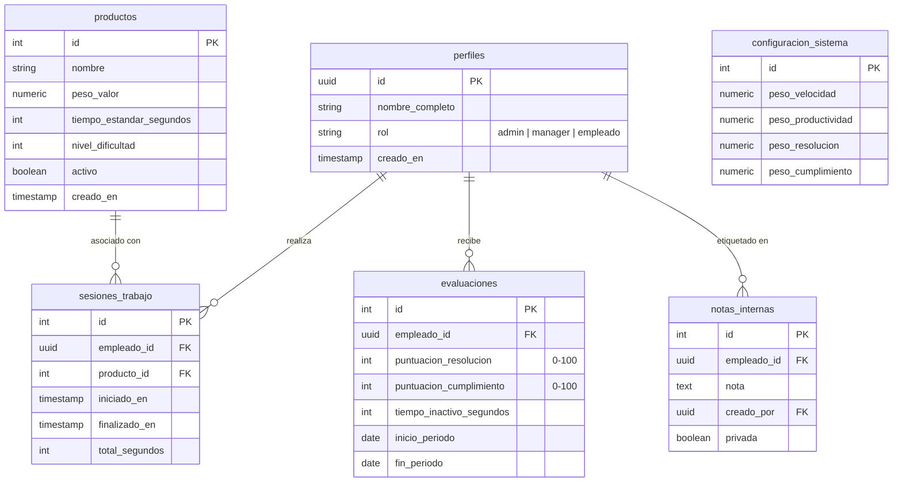

# STATLINE by PaChef — Documento Técnico

## 1. Objetivo del Sistema

Una aplicación web enfocada a móviles (mobile-first) para la medición y análisis del rendimiento de producción interna en tiempo real.

**Capacidades Principales:**

- **Gestión:** Registro de empleados y productos.
- **Medición:** Cronómetro integrado para un seguimiento preciso del tiempo.
- **Analítica:** Cálculo automático de métricas clave de rendimiento.
- **Visualización:**
  - **Admin:** Estadísticas visuales "estilo videojuego" (ej. cartas de jugadores).
  - **Manager:** Paneles de control (dashboards) de estilo corporativo.
  - **Empleado:** Evolución personal y rendimiento relativo.
- **Despliegue:** 100% basado en la web, sin necesidad de aplicación nativa.

## 2. UI / UX y Diseño Visual

La interfaz debe sentirse viva, moderna y altamente responsiva. No es solo una herramienta de recolección de datos; es una plataforma de visualización dinámica.

**Paleta de Colores Oficial**
El diseño se basará en una paleta pulida y de alto contraste, ideal para leer datos rápidamente:

- **Crema (Fondo Principal / Tarjetas):** `#FEFEF3`
- **Azul (Acentos / Botones Secundarios):** `#3D4F7E`
- **Naranja (Llamados a la Acción / Alertas / Destacados):** `#E18546`
- **Azul Oscuro (Textos Principales / Fondos de Menú):** `#262236`

**Principios de Interfaz**

- **Navegación Dinámica (Sidebar):** Implementación de una barra lateral (sidebar) colapsable en escritorio y tipo "menú hamburguesa" o barra inferior en móviles, utilizando el Azul Oscuro (`#262236`) para separar visualmente la navegación del contenido principal (Crema `#FEFEF3`).
- **Mobile-First Estricto:** Botones grandes, sin tablas de desplazamiento horizontal infinito, acciones accesibles con el pulgar.
- **Gamificación Visual:** Gráficos de radar, tarjetas de "jugador" estilo PES/FC para los empleados, e indicadores de KPI grandes y claros.
- **Claridad y Pulido:** Uso de tokens de diseño modernos (degradados sutiles, micro-animaciones en interacciones, toques de glassmorphism o cristal esmerilado en modales).

## 3. Arquitectura General

**Frontend**

- **Entorno:** Next.js 14+ (App Router, sin directorio `src/`).
- **Estrategia de Renderizado:**
  - _Server Components:_ Vistas pesadas en datos y cargas iniciales de página.
  - _Client Components:_ Elementos interactivos (Cronómetro, Suscripciones en tiempo real, Gráficos).
- **Estilos:** TailwindCSS.
- **Autenticación:** Gestionada a través de Supabase Auth.

**Backend y Base de Datos**

- **Base de Datos:** Supabase PostgreSQL.
- **Seguridad:** Políticas de Seguridad a Nivel de Fila (RLS).
- **Tiempo Real:** Supabase Realtime para actualizaciones en vivo.
- **Lógica Core:** La lógica crítica de las métricas reside en Vistas SQL y funciones; el frontend actúa como consumidor para aligerar la carga del cliente.

## 4. Roles de Usuario y Funcionalidades

**[Admin] — "Modo Juego"**
La interfaz más interactiva y visual, inspirada en las estadísticas de los videojuegos de deportes.

- **Gestión:** CRUD completo para Empleados y Productos.
- **Configuración:** Ajuste de los pesos de las métricas y los tiempos estándar de producción.
- **Insights:** Visión completa de métricas, notas privadas internas, y capacidad para forzar el recálculo de métricas.

**[Manager] — "Modo Corporativo"**
Un dashboard limpio y conciso para el monitoreo de alto nivel.

- **Dashboard:** Visión general y clasificaciones (rankings) del equipo.
- **Análisis:** Rendimiento por producto, evolución a lo largo del tiempo, y comparaciones del empleado vs. el promedio.
- **Filtros:** Filtros de tiempo para datos históricos.
- **Acceso:** Sin configuración de pesos ni acceso a notas privadas de RRHH.

**[Empleado] — "Modo Personal"**
Un panel de control enfocado en el progreso individual.

- **Seguimiento Personal:** Vista de métricas personales, evolución y productos con mejor rendimiento.
- **Evaluación Comparativa:** Comparación contra un promedio anónimo del equipo.
- **Privacidad:** No puede ver datos pertenecientes a otros empleados.

## 5. Modelo de Base de Datos (Esquema)



## 6. Métricas y Fórmulas

Todos los cálculos se realizan a través de Vistas SQL para garantizar consistencia y rendimiento.

| Métrica                  | Fórmula / Lógica                                                                              |
| :----------------------- | :-------------------------------------------------------------------------------------------- |
| **Puntaje de Velocidad** | `ratio_velocidad = (tiempo_estandar / tiempo_real)`. Normalizado a una escala de 0–100.       |
| **Productividad**        | `SUM(productos.peso_valor)` por período. Normalizado contra el promedio del equipo.           |
| **Rendimiento**          | `(Productividad Ponderada / Tiempo Efectivo)`. Tiempo Efectivo = Total - Inactivo.            |
| **Puntaje Global**       | Suma ponderada de Velocidad, Productividad, Resolución y Cumplimiento. (Pesos configurables). |

**Especialización por Producto**
Una vista específica (`estadisticas_producto_empleado`) rastrea:

- Velocidad Promedio por producto.
- Total Completado de artículos.
- Puntaje de Eficiencia y Calificación del Producto.
- **Resultado:** Revela dónde es más eficiente un empleado (ej. Tareas complejas: 91 vs. Tareas rutinarias: 67).

## 7. Detalles de Implementación Técnica

**Suscripciones en Tiempo Real**
El sistema se suscribe a `sesiones_trabajo` y `evaluaciones` para habilitar:

- Actualizaciones del cronómetro en vivo en todos los dispositivos.
- Clasificaciones interactivas en tiempo real.
- Actualizaciones instantáneas de los dashboards.

**Estructura del Proyecto (Next.js)**

```plaintext
app/
├── (auth)/login/       # Rutas de autenticación
├── dashboard/          # Layout principal que incluye el Sidebar
│   ├── admin/          # Vistas exclusivas de administrador
│   ├── manager/        # Vistas de gerencia
│   └── empleado/       # Vistas personales
├── empleados/          # Gestión de personal
├── productos/          # Gestión del catálogo
├── sesiones/           # Historial y control de tiempos
└── configuracion/      # Ajustes del sistema y métricas
components/
├── ui/                 # Componentes base (shadcn/personalizados con la paleta de colores)
├── layout/             # Componentes estructurales (Sidebar, Topbar)
├── charts/             # Gráficos de Radar, Barras, Área
├── cards/              # Tarjetas de jugador "Estilo PES"
└── cronometro/         # Lógica de seguimiento en tiempo real
lib/
├── supabase/           # Helpers para el cliente y Autenticación
└── utils/              # Funciones de roles y formateo de datos
```

**Lógica del Cronómetro**

- **Iniciar:** Inserta una `sesion_trabajo` con la fecha en `iniciado_en`.
- **Pausar:** Actualiza la acumulación de `total_segundos`.
- **Detener:** Registra `finalizado_en` y cierra la sesión.
- **Persistencia:** El estado se guarda en la base de datos (sesiones con `finalizado_en IS NULL`) para que persista aunque se recargue la página.

## 8. Seguridad y Rendimiento

**Seguridad a Nivel de Fila (RLS)**

- **Empleado:** Solo puede hacer SELECT de sus propios registros.
- **Manager:** Puede hacer SELECT de todo, pero no puede hacer UPDATE.
- **Admin:** Acceso total (SELECT, INSERT, UPDATE, DELETE).

**Optimización de Rendimiento**

- **Indexación:** Fuerte indexación en `empleado_id`, `producto_id`, y `creado_en`.
- **Vistas Materializadas:** Utilizadas para métricas globales pesadas para evitar cuellos de botella en cálculos en tiempo real.
- **Cálculo Perezoso (Lazy):** Métricas calculadas por período o bajo demanda en lugar de en cada renderizado.

## 9. Roadmap Futuro (Escalabilidad)

- Multitenencia (múltiples equipos/empresas).
- Exportación a CSV/PDF.
- Alertas de rendimiento automatizadas.
- Predicción de rendimiento impulsada por IA.
- API pública para integraciones externas.

---

> **STATLINE by PaChef** no es solo una aplicación decorativa; es un sistema de modelado cuantitativo para el rendimiento en tiempo real. Construido correctamente, no solo muestra quién rinde mejor, sino que identifica exactamente dónde debe desplegarse cada persona para lograr la máxima eficiencia.
